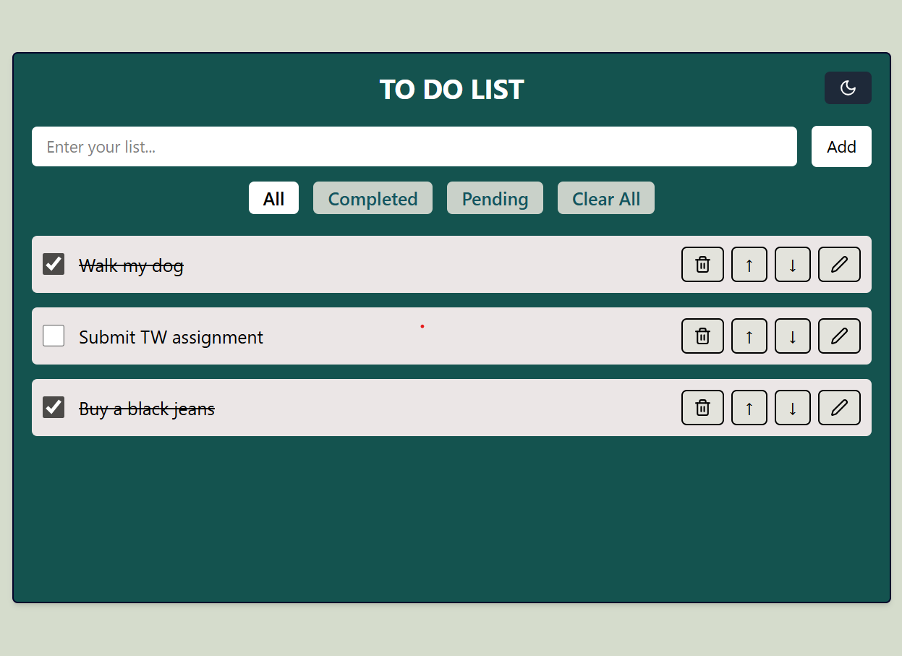
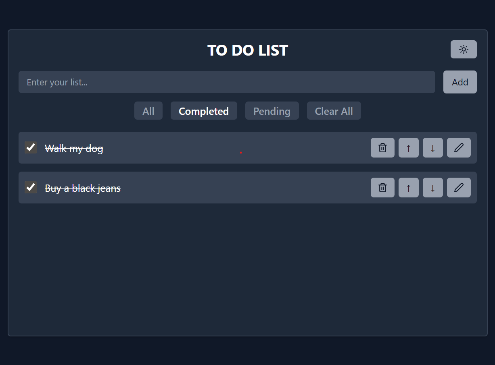

<!-- # 📝 React Todo List App -->

A responsive and minimalistic **Todo List** application built with **React** and **Tailwind CSS**, featuring:

- Add, edit, delete, reorder tasks
- Filter by status (All, Completed, Pending)
- LocalStorage persistence
- Dark mode toggle

---

<!-- ## 🚀 Live Demo -->

👉 [View Live App]
(https://exerik.github.io/react-todo-list/)


---

<!-- ## 🛠️ Technologies Used -->

- ⚛️ **React** (with hooks like `useState`, `useEffect`, `useRef`)
- 🌬️ **Tailwind CSS** for fast, responsive styling
- 💡 **Lucide Icons** for UI icons (`Trash2`, `Edit2`, `Sun`, `Moon`, etc.)
- 🧠 **LocalStorage** for data persistence across reloads

---

<!-- ## ⚙️ Setup Instructions -->

Follow the steps below to run this app locally:

<!-- ### 1. Clone the Repository -->

```bash
git clone https://github.com/exeRik/react-todo-list.git
cd react-todo-list

#  then install dependencies:
npm install

# then start the development server 
npm run dev


---

## ✨ Features

✅ Add new tasks  
📝 Edit task names  
❌ Delete tasks  
🔃 Reorder tasks (move up/down)  
🔍 Filter tasks by **All**, **Completed**, or **Pending**  
🌗 Toggle between **Dark Mode** and **Light Mode**  
💾 Automatically saves data to **LocalStorage** for persistence  
📱 Fully responsive design for mobile and desktop


📸 Screenshots

<br>
 
---

## 🛠️ Technologies Used

| Tech           | Description                                                   |
|----------------|---------------------------------------------------------------|
| ⚛️ React        | Frontend framework using functional components and hooks      |
| 🌬️ Tailwind CSS | Utility-first CSS framework for rapid UI styling             |
| 💡 Lucide Icons | Icon set used for edit, delete, reorder, and theme toggle UI |
| 💾 LocalStorage | Stores user tasks persistently across page reloads           |

Used React hooks:
- `useState`
- `useEffect`
- `useRef`


